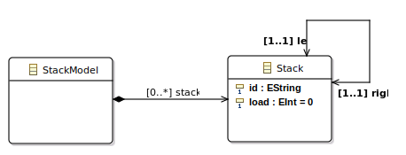

## About

This project contains the MOMoT framework extended for Reinforcement Learning (RL) methods to use for rule-orchestrated model transformations. The MOMoT Framework comprises a toolset to represents problem domains by means of Ecore meta-models and therefrom derived models as the initial problem state to be optimized through model transformations. 

The extension integrates several RL algorithms ready-to-use in the existing architecture and can be used for finding valuable rule compositions next to already supported evolutionary algorithms and local search approaches. The project includes case studies that evaluate the in this context newly introduced algorithms against the Non-Dominated Sorting Algorithm (NSGA-II).

* Overview
    * [Requirements](#requirements)
    * [Running the case studies](#running-the-case-studies)
        * [Example: Stack Load Balancing](#example-stack-load-balancing)
    * [General use](#general-use)


## Requirements

A list of the required programs, how to set them up and how to configure the environment in order to support our project, and other preliminaries
can be found in in this repository in installation.pdf.

In short:

- In an Eclipse workspace, import the project and all subprojects
- Install Xtext
  
  - Repository site: https://download.eclipse.org/releases/2023-03/
  - "Modeling" -> "Xtext Complete SDK"

- Install Henshin

  - Repository site: https://download.eclipse.org/modeling/emft/henshin/updates/1.8.0/


- Run the experiment setup as described in [Running the case studies](#running-the-case-studies)
 
## Running the case studies

Generally, MOMoT requires a search configuration which defines the (problem) model instance, a set of transformation rules,
objectives, constraints, and a selection of algorithms to execute an experiment. The artifacts for each case study are present in the repository as follows:

* Stack Load Balancing (SLB) -> *at.ac.tuwien.big.momot.examples.stack/src/at.ac.tuwien.big.momot.examples.stack* (**main: StackSearch.java**)
* Class Responsibility Assignment (CRA) -> *at.ac.tuwien.big.momot.examples.cra/src/icmt.tool.momot.demo* (**main: ArchitectureSearch.java**)
* Refactoring -> *at.ac.tuwien.big.momot.examples.refactoring/src/at.ac.tuwien.big.momot.examples.refactoring* (**main: RefactoringSearch.java**)
* Container Relocation Problem (CRP) -> *org.pacman/src/PacmanGame.search* (**main: ContainerSearch.java**)


The "main"-files contain an executable search setup. In these files, one can adapt the experiment setup prior execution w.r.t the initial model instance (*INITIAL_MODEL*), maximum transformation length (*SOLUTION_LENGTH*), and the population size (*POPULATION_SIZE*) used for NSGA-II. *MAX_EVALUATIONS* and *NR_RUNS* define the maximum number of solution evaluations per trial and the number of trials for the experiment. Algorithms and corresponding parameters are configured for the experiment in method *createOrchestration(...)*.

**Note: File may need to be run with additioanl VM argument "--add-opens java.base/java.util=ALL-UNNAMED" or newer compatibility with newer Java versions**

Upon running a "main"-file, the setup will be executed and the console inform on the ongoing process, that is:
 * The experiment settings for the running program.
 * Execution progress regarding the currently executed trial for respectively included algorithms. 
 * Summary statistics and various quality indicators for the performance comparison between tested algorithms. For instance, Hypervolume for each run and aggregated over runs, the objective vectors of obtained solution sets, etc.

### Example: Stack Load Balancing

Resources for this example are to be found in the project *at.ac.tuwien.big.momot.examples.stack*. Hereby, a *StackModel* (*stack.ecore* in *model* folder) consists of up to multiple *Stack*s with a load each. The goal in this case is to apply shift-operations in form of two rules, *shiftLeft* and *shiftRight*, where a certain amount is 
transfered from the source stack to its left or right neighbour, i.e., the target stack. Note that the shift amount is chosen randomly by the Henshin Engine but set to a maximum of 5 units in one transformation step for this problem domain. (see *StackOrchestration.java* in *src\at\ac\tuwien\big\momot\examples\stack*).
<figure>


<figcaption><b>Meta-Model: Stack Load Balancing Case Study</b></figcaption>
</figure>

Model instances reprenting varying complexity levels are stored in the *model*-folder. For an example, using the model with five stacks as initial problem instance, allowing for up to 8 shift operations, and repeating the experiment 3 times with 5,000 iterations each, we set the variables in *StackSearch.java* as follows:

```java
private static final int SOLUTION_LENGTH = 8;
private static final String INPUT_MODEL = "model_five_stacks.xmi";
private static final int NR_RUNS = 3;
private static final int MAX_EVALUATIONS = 5000;
```

When executed, the output looks as follows:

<details>
  <summary>Click to show console output</summary>
  
  ```
  -------------------------------------------------------
Search
-------------------------------------------------------
Objectives:      [Standard Deviation, SolutionLength]
NrObjectives:    2
Constraints:     []
NrConstraints:   0
Transformations: [Stack]
Units:           [Rule shiftLeft(fromId, toId, amount, fromLoad, toLoad), Rule shiftRight(fromId, toId, amount, fromLoad, toLoad)]
SolutionLength:  8
PopulationSize:  100
Iterations:      50
MaxEvaluations:  5000
AlgorithmRuns:   3
---------------------------
Run 'NSGAII' 3 times...
[05:05:00.119] Run 1 of 3 started.
[05:05:03.081] Run 1 of 3 terminated after 00:00:02.955 (2955 ms).
[05:05:03.083] Run 2 of 3 started.
[05:05:03.842] Run 2 of 3 terminated after 00:00:00.758 (758 ms).
[05:05:03.843] Run 3 of 3 started.
[05:05:04.467] Run 3 of 3 terminated after 00:00:00.624 (624 ms).
[05:05:04.469] Total runtime for 3 seeds: 00:00:04.350 (4350 ms).
Run 'QLearningExplore' 3 times...
[05:05:04.485] Run 1 of 3 started.
[05:05:06.183] Run 1 of 3 terminated after 00:00:01.696 (1696 ms).
[05:05:06.189] Run 2 of 3 started.
[05:05:07.783] Run 2 of 3 terminated after 00:00:01.594 (1594 ms).
[05:05:07.784] Run 3 of 3 started.
[05:05:09.438] Run 3 of 3 terminated after 00:00:01.653 (1653 ms).
[05:05:09.439] Total runtime for 3 seeds: 00:00:04.954 (4954 ms).
Run 'QLearning' 3 times...
[05:05:09.442] Run 1 of 3 started.
[05:05:11.886] Run 1 of 3 terminated after 00:00:02.444 (2444 ms).
[05:05:11.888] Run 2 of 3 started.
[05:05:14.215] Run 2 of 3 terminated after 00:00:02.327 (2327 ms).
[05:05:14.217] Run 3 of 3 started.
[05:05:16.624] Run 3 of 3 terminated after 00:00:02.407 (2407 ms).
[05:05:16.626] Total runtime for 3 seeds: 00:00:07.183 (7183 ms).
-------------------------------------------------------
Analysis
-------------------------------------------------------
---------------------------
Analysis Results
---------------------------
NSGAII:
    Hypervolume: 
        Aggregate: 0.4989877579547276
        Min: 0.4804635643013558
        Median: 0.4989877579547276
        Max: 0.4989877579547276
        Mean: 0.492813026736937
        StandardDeviation: 0.01069494819229498
        Variance: 1.1438191683587365E-4
        Count: 3
        Indifferent: [QLearningExplore, QLearning]
        EffectSize: [
            - { measure: CohensD, algorithm: QLearningExplore, effectSize: 0.816496580927726, magnitude: large }
            - { measure: CliffsDelta, algorithm: QLearningExplore, effectSize: 0.3333333333333333, magnitude: medium }
            - { measure: VarghaDelaneyA, algorithm: QLearningExplore, effectSize: 0.3333333333333333 }
            - { measure: CohensD, algorithm: QLearning, effectSize: 1.779545233537748, magnitude: large }
            - { measure: CliffsDelta, algorithm: QLearning, effectSize: 0.7777777777777778, magnitude: large }
            - { measure: VarghaDelaneyA, algorithm: QLearning, effectSize: 0.8888888888888888 }
        ]
        Values: [0.4989877579547276, 0.4989877579547276, 0.4804635643013558]
QLearningExplore:
    Hypervolume: 
        Aggregate: 0.4989877579547276
        Min: 0.4989877579547276
        Median: 0.4989877579547276
        Max: 0.4989877579547276
        Mean: 0.4989877579547276
        StandardDeviation: 0.0
        Variance: 0.0
        Count: 3
        Indifferent: [NSGAII, QLearning]
        EffectSize: [
            - { measure: CohensD, algorithm: NSGAII, effectSize: 0.816496580927726, magnitude: large }
            - { measure: CliffsDelta, algorithm: NSGAII, effectSize: 0.3333333333333333, magnitude: medium }
            - { measure: VarghaDelaneyA, algorithm: NSGAII, effectSize: 0.6666666666666666 }
            - { measure: CohensD, algorithm: QLearning, effectSize: 4.538540534168039, magnitude: large }
            - { measure: CliffsDelta, algorithm: QLearning, effectSize: 1.0, magnitude: large }
            - { measure: VarghaDelaneyA, algorithm: QLearning, effectSize: 1.0 }
        ]
        Values: [0.4989877579547276, 0.4989877579547276, 0.4989877579547276]
QLearning:
    Hypervolume: 
        Aggregate: 0.48477364423394687
        Min: 0.4727905920581036
        Median: 0.4727905920581036
        Max: 0.48477364423394687
        Mean: 0.4767849427833847
        StandardDeviation: 0.006918418399436447
        Variance: 4.786451314966077E-5
        Count: 3
        Indifferent: [NSGAII, QLearningExplore]
        EffectSize: [
            - { measure: CohensD, algorithm: NSGAII, effectSize: 1.779545233537748, magnitude: large }
            - { measure: CliffsDelta, algorithm: NSGAII, effectSize: 0.7777777777777778, magnitude: large }
            - { measure: VarghaDelaneyA, algorithm: NSGAII, effectSize: 0.1111111111111111 }
            - { measure: CohensD, algorithm: QLearningExplore, effectSize: 4.538540534168039, magnitude: large }
            - { measure: CliffsDelta, algorithm: QLearningExplore, effectSize: 1.0, magnitude: large }
            - { measure: VarghaDelaneyA, algorithm: QLearningExplore, effectSize: 0.0 }
        ]
        Values: [0.48477364423394687, 0.4727905920581036, 0.4727905920581036]
---------------------------
- Save Analysis to 'output/analysis/analysis.txt'
- Save Indicator BoxPlots to 'output/analysis/'
-------------------------------------------------------
Results
-------------------------------------------------------
REFERENCE SET:

2.8284271247461903 0.0
2.0976176963403033 1.0
0.6324555320336759 3.0
0.8944271909999159 2.0
0.0 5.0

- Save objectives of all algorithms to 'output/objectives/objective_values.txt'
- Save models of all algorithms to 'output/models/'
- Save objectives of algorithms seperately to 'output/objectives/<algorithm>.txt'
- Save models of algorithms seperately to 'output/solutions/<algorithm>.txt'´

QLearning
2.8284271247461903 0.0
2.0976176963403033 1.0
1.0954451150103321 2.0
0.6324555320336759 3.0


NSGAII
0.6324555320336759 3.0
2.8284271247461903 0.0
2.0976176963403033 1.0
0.8944271909999159 2.0
0.0 5.0


QLearningExplore
2.8284271247461903 0.0
0.0 5.0
2.0976176963403033 1.0
0.6324555320336759 3.0
0.8944271909999159 2.0
  ```
</details>

## General use

### How the RL approaches can be employed for problem cases

The new RL methods and required utilities are implemented in the MOMoT core plugins as provided in this project. The following examples show how one instantiates an agent to conduct an experiment.

Algorithms are employed in MOMoT by creating them with a corresponding "Factory" object first
and then adding them to the orchestration: 

```java
// Create factory for evolutionary algorithms
final EvolutionaryAlgorithmFactory<TransformationSolution> moea = orchestration
            .createEvolutionaryAlgorithmFactory(populationSize);
// Add NSGA-II to orchestration      
orchestration.addAlgorithm("NSGA-II",
    moea.createNSGAII(new TournamentSelection(2), new OnePointCrossover(1.0),
        new TransformationParameterMutation(0.1, orchestration.getModuleManager()),
        new TransformationPlaceholderMutation(0.2))
);
```

For the RL agents, an Environment object is created first with information on the problem domain 
and further used to to initialize the *RLAlgorithmFactory*:

```java
// Create environment
final IEnvironment<TransformationSolution> env = new Environment<>(
    new SolutionProvider<>(orchestration.getSearchHelper()), 
    new ObjectiveFitnessComparator<TransformationSolution>(
                  orchestration.getFitnessFunction().getObjectiveIndex("Standard Deviation")
    )
);
// Create factory with environment for reinforcement learning algorithms
final RLAlgorithmFactory<TransformationSolution> rlFactory = orchestration.createRLAlgorithmFactory(env);
```

A *SolutionProvider* and a fitness function *ObjectiveFitnessComparator* with the objective name, here "Standard Deviation", are passed to the *Environment* constructor.

Then the algorithm can be created and added to the evaluation as usual. The basic Q-Learning agent, for example, is instantiated as follows:

```java
// Add basic Q-Learning algorithm with parameters gamma, epsilon, etc.
orchestration.addAlgorithm("QLearning", rlFactory.createSingleObjectiveQLearner(0.9, 0.9, true, 1e-4, 0.1, null);
```